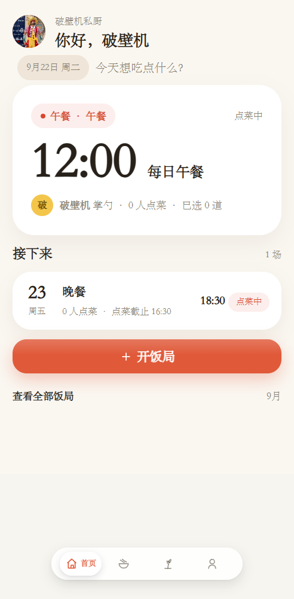
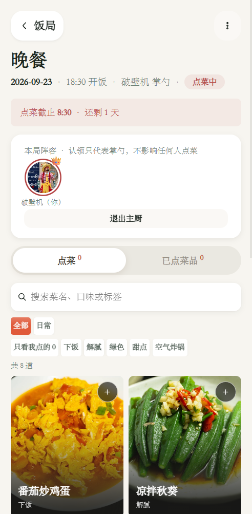
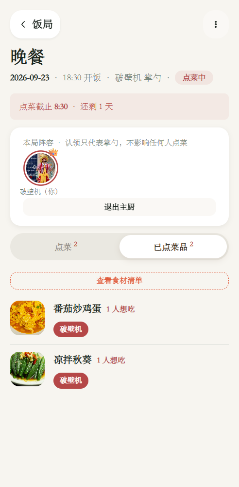
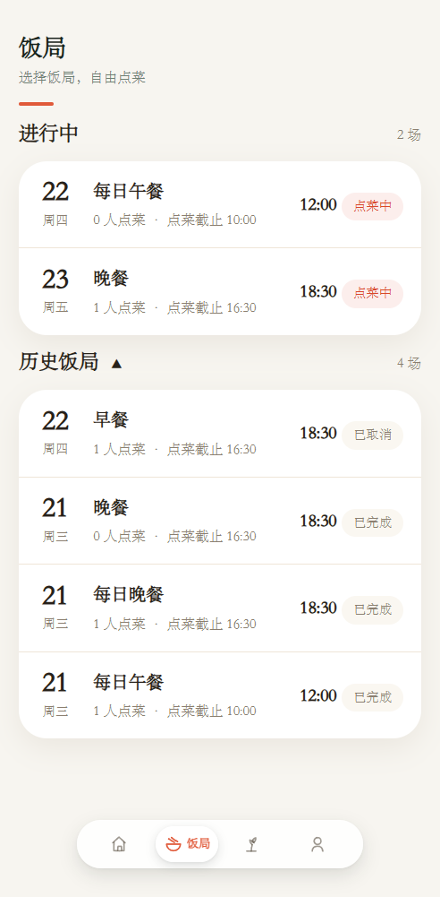
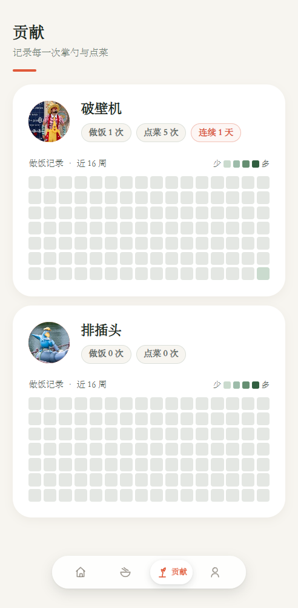
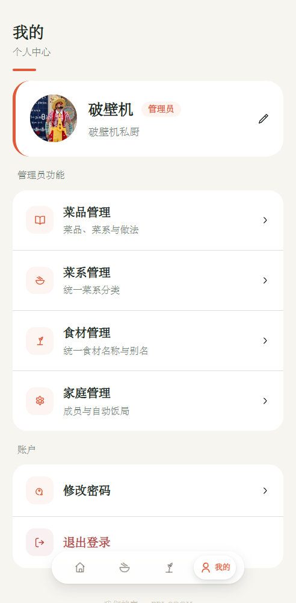
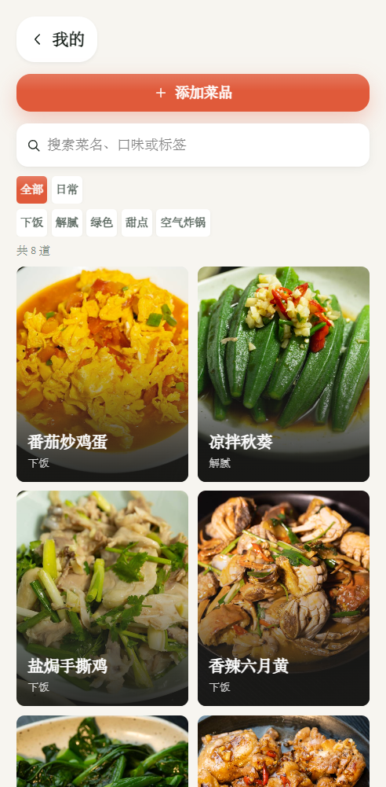
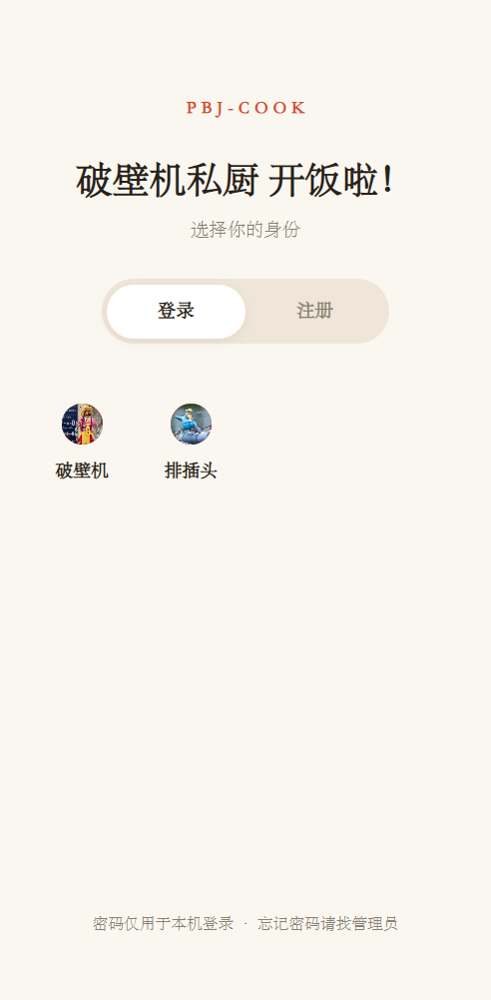

# PBJCook

- 这是一个基于家庭做饭场景的应用，为了增加家庭做饭的仪式感，并且可以记录历史上做过的饭菜记录，极具成就感，并且有餐厅点菜般的优雅体验
- 灵感来自于`Gloridust/GanCook`，为了降低使用成本，进行`uniapp`重写，支持发布微信小程序版本或H5版本，并对UI进行全面重构，用更加现代，更少的按钮提高家庭做饭的仪式感
- 我觉得一个东西必须做出来人愿意用才是好东西，一开始我以网页形式发布并且以`IP:Port`
  的方式发布，很明显大家对这种形式很不信任，所以我开始使用AI对项目进行Uniapp重写，并且对UI体验做了大量的优化和功能上做了扩展

## 目录

- `frontend/`：Vue 3 + uni-app，包含微信小程序与 H5 构建
- `backend/`：Python + FastAPI + SQLite，数据和上传文件默认位于 `backend/data/`

## 功能一览

<table>
<tr style="display: flex">
<td align="center"></td>
<td align="center"></td>
<td align="center"></td>
<td align="center"></td>
</tr>
<tr style="display: flex">
<td align="center"></td>
<td align="center"></td>
<td align="center"></td>
<td align="center"></td>
</tr>
</table>

## QuickStart

### 方式一：Docker Compose 快速启动（推荐）

使用 Docker Compose 可以一键启动完整应用，无需手动配置环境：

```powershell
# 克隆项目后进入 deployment 目录
cd deployment

# 启动服务
docker compose up -d

# 查看日志
docker compose logs -f
```

应用启动后：

- **前端访问**：`http://localhost:8000`
- **API 文档**：`http://localhost:8000/docs`

```powershell
# 停止服务
docker compose down

# 停止服务并删除数据卷
docker compose down -v
```

> 数据持久化：数据库和上传文件存储在 `deployment/data` 目录

### 方式二：手动启动（开发调试）

#### 启动后端

```powershell
cd backend
python -m venv .venv
.venv\Scripts\pip install -r requirements.txt
.venv\Scripts\python -m uvicorn app.main:app --reload --host 0.0.0.0 --port 8000
```

接口文档：`http://127.0.0.1:8000/docs`

#### 启动前端

```powershell
cd frontend
npm install
npm run dev:h5
```

微信小程序构建：

```powershell
npm run build:mp-weixin
```

构建产物位于 `frontend/dist/build/mp-weixin`，使用微信开发者工具导入。真机访问时，在"我的 → 服务器设置"填写局域网或 HTTPS
后端地址；正式发布要求在小程序后台配置合法 HTTPS 域名。

## 开发模式自动初始化测试数据

### Docker Compose 方式

修改 `deployment/docker-compose.yml` 中的环境变量：

```yaml
environment:
  - DACOOK_SEED_DEV=1  # 改为 1 启用测试数据
```

然后重新启动：

```powershell
docker compose down
docker compose up -d
```

### 手动启动方式

设置环境变量 `DACOOK_SEED_DEV=1` 后启动后端，会自动填充测试数据用于调试：

```powershell
$env:DACOOK_SEED_DEV="1"; python -m uvicorn app.main:app --reload --host 0.0.0.0 --port 8000
```

填充的数据包括：

- **测试用户**：张三（管理员，PIN:123456）、李四、王五（普通用户，PIN:123456）
- **菜系**：川菜🌶️、粤菜🥟、鲁菜🍜、苏菜🦀、西餐🍝
- **菜品**：8 道示例菜品，均含食材清单和烹饪步骤
- **饭局**：今日午餐、今日晚餐、明日午餐
- **点餐记录**：李四和王五在今日午餐中各有若干点餐

> 数据填充是幂等的，重复启动不会重复插入。正常生产模式请勿设置该变量。

## 环境变量

| 变量                    | 说明                 | 默认值                                           |
|-----------------------|--------------------|-----------------------------------------------|
| `DACOOK_DATABASE`     | SQLite 数据库文件路径     | `backend/data/dacook.db`                      |
| `DACOOK_UPLOADS`      | 上传文件存储目录           | `backend/data/uploads`                        |
| `DACOOK_TIMEZONE`     | 时区                 | `Asia/Shanghai`                               |
| `DACOOK_CORS_ORIGINS` | 允许的 CORS 来源，逗号分隔   | `http://localhost:5173,http://127.0.0.1:5173` |
| `DACOOK_SEED_DEV`     | 设为 `1` 时启动自动填充测试数据 | 不设置                                           |

## 功能范围

首位成员创建家庭并成为管理员；支持头像成员选择登录、注册口令、菜品与菜系、食材和步骤、饭局点菜、掌勺认领、菜品跳过、状态流转、饭后评价、贡献热力图、成员管理和自动饭局规则。
